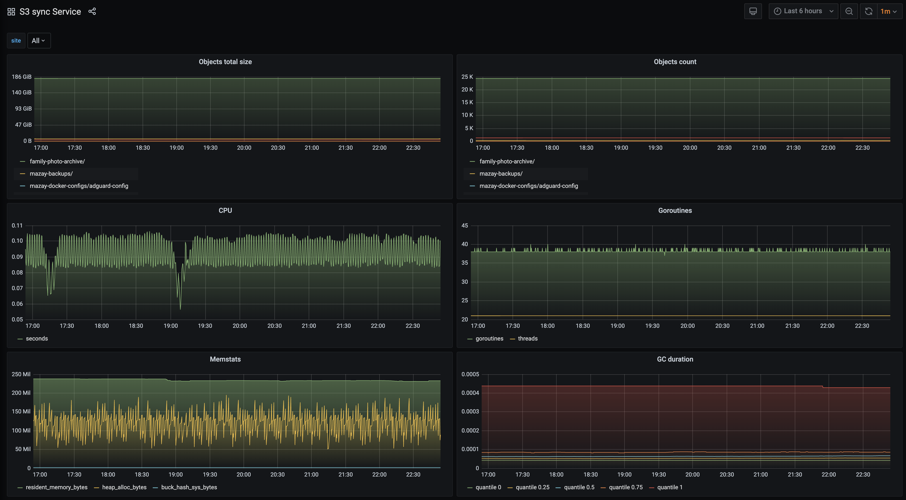

<!--
s3sync-service - Realtime S3 synchronisation tool
Copyright (c) 2020  Yevgeniy Valeyev

This program is free software: you can redistribute it and/or modify
it under the terms of the GNU General Public License as published by
the Free Software Foundation, either version 3 of the License, or
(at your option) any later version.

This program is distributed in the hope that it will be useful,
but WITHOUT ANY WARRANTY; without even the implied warranty of
MERCHANTABILITY or FITNESS FOR A PARTICULAR PURPOSE.  See the
GNU General Public License for more details.

You should have received a copy of the GNU General Public License
along with this program.  If not, see <http://www.gnu.org/licenses/>.
 -->

# Prometheus exporter

The application has built in [Prometheus](https://prometheus.io/) exporter, which exposes a set of [Golang](https://golang.org/) metrics as well as some application related metrics. The exporter is listening for port `9350` by default and exposes metrics under `/metrics` subpath, both options could be changed via [the command line arguments](configuration.md#command-line-args).

## Custom metrics

| Metric name | Description | Metric type |
|-------------|-------------|-------------|
| s3sync_data_total_size | Total size of the synced objects | Gauge |
| s3sync_data_objects_count | Total number of the synced objects | Gauge |
| s3sync_errors_count | Number of errors, could be used for alerting | Counter |

---

## Grafana dashboard

The exposed metrics can be used to create alerts and/or [Grafana](https://grafana.com/) dashboards similar to the following, the source is available [here](https://raw.githubusercontent.com/mazay/s3sync-service/master/grafana/sample-dashboard.json).

